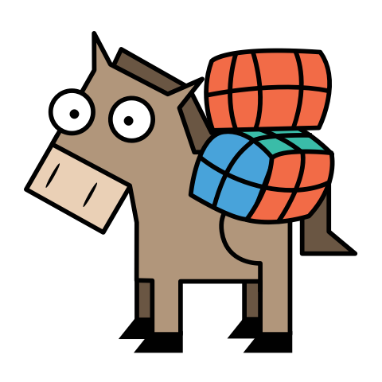

# Workhorse Persistence MySQL Legacy

> Legacy support for the MySQL Persistence of Workhorse version 1.5

## Table of Contents


- [Prerequisites](#prerequisites)
- [Install](#install)
- [Getting started](#getting-started)
- [Maintainers](#maintainers)
- [Changelog](#changelog)
- [Contribute](#contribute)
- [License](#license)
  

## Prerequisites

Before you begin, ensure you have met the following requirements:
* You have installed at least [Java 8](http://www.oracle.com/technetwork/java/javase/downloads/jdk8-downloads-2133151.html)
* You have [Maven](https://maven.apache.org/download.cgi) running on your system
 

## Install

1. Add the following dependency to your project ([published on Maven Central](https://search.maven.org/artifact/io.coodoo/workhorse-persistence-mysql-legacy/))
   
   ```xml
   <dependency>
       <groupId>io.coodoo</groupId>
       <artifactId>workhorse-persistence-mysql-legacy</artifactId>
       <version>2.0.0-RC1-SNAPSHOT</version>
   </dependency>
   ```
   
2. Create the database tables and add the JPA entities to your persistence.xml
   
   You can find a SQL script to create the tables [here](./src/main/resources/mysql-schema.sql).
   
   ```xml
	<class>io.coodoo.workhorse.jobengine.entity.Job</class>
	<class>io.coodoo.workhorse.jobengine.entity.JobExecution</class>
	<class>io.coodoo.workhorse.config.entity.Config</class>
	<class>io.coodoo.workhorse.log.entity.Log</class>
	<class>io.coodoo.workhorse.api.entity.LogView</class>
	<class>io.coodoo.workhorse.api.entity.JobExecutionView</class>
   ```
3. To provide the EntityManager you have to implement a `@JobEngineEntityManagerProducer` CDI producer.

   ```java
    @Stateless
    public class JobEngineEntityManagerProducer {
    
        @PersistenceContext
        private EntityManager entityManager;
    
        @Produces
        @JobEngineEntityManager
        public EntityManager getEntityManager() {
            return entityManager;
        }
    }
    ```
    *This is necessary to avoid trouble when it comes to different persistence contexts.*


## Getting started

After the [installation](#install) all you need is to create an `MysqlLegacyConfig` instance an pass it to the `start()` method of the `WorkhorseService`.

```java
@Inject
WorkhorseService workhorseService;

public void startWithMysqlLegacyPersistence() {
    MysqlLegacyConfig mysqlLegacyConfig = new MysqlLegacyConfigBuilder().build();
    workhorseService.start(mysqlLegacyConfig);
}
```

If you are using this persistence, you should already have your configuration provided in your MySQL database. Otherwise you can pass the configuration you want using the builder on `MysqlLegacyConfig`.


## Changelog

All release changes can be viewed on our [changelog](./CHANGELOG.md).


## Maintainers

[coodoo](https://github.com/orgs/coodoo-io/people)


## Contribute

Pull requests and issues are welcome.


## License

[Apache-2.0 © coodoo GmbH](./LICENSE)

Logo: [Martin Bérubé](http://www.how-to-draw-funny-cartoons.com)
  
